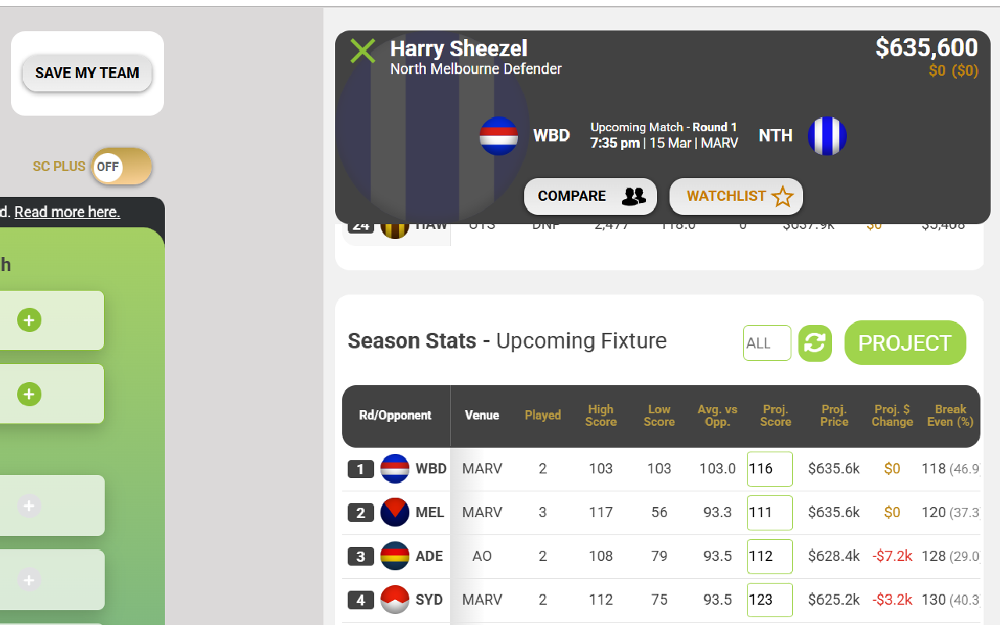
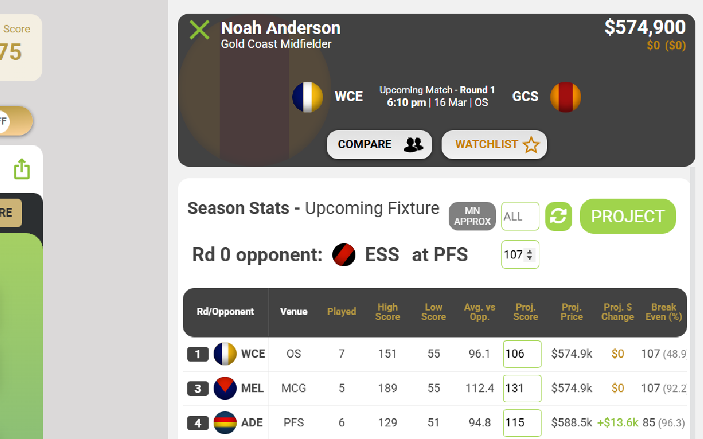
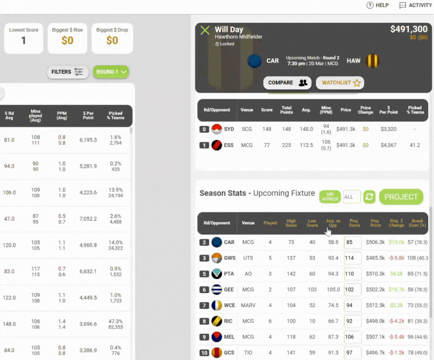

# SCprojector

SCprojector is a lightweight browser extension designed to provide real-time price projections for Supercoach players via historical  data analysis, allowing users anticipate player price movements and make informed trade decisions.
<div style="display: flex; justify-content: space-around;">
    
    
</div>
<br>

SCprojector seamlessly integrates into the Supercoach UI, and since its release, the extension has grown to **over 1000 active users**, helping Supercoach players optimize their teams with greater confidence. 

## Table of Contents
- [Installation/Setup](#installationsetup)
- [Real-Time Price Projections](#real-time-price-projections)
- [Technologies Used](#technologies-used)
- [License](#license)

## Installation/Setup
SCprojector is available on both the Chrome Web Store and Firefox Add-ons marketplace:

- **[Chrome Web Store](https://chromewebstore.google.com/detail/scprojector/kdeoaeaoljglddfcekeomcelneihjkhj)** (also works on Microsoft Edge)
- **[Firefox Add-ons](https://addons.mozilla.org/en-US/firefox/addon/scprojector/)**
<br>

#### Manual Installation
If you prefer to load the extension manually for development or testing, follow these steps:

1. Clone the repository:
   ```sh
   git clone https://github.com/Freddynnn/SupercoachPriceProjection.git
   ```
2. Install dependencies:
   ```sh
   npm install
   ```
3. Build the extension:
   ```sh
   npm run build
   ```
4. Load the extension in Chrome:
   - Open Chrome and go to `chrome://extensions/`
   - Enable "Developer mode" (toggle in the top right corner)
   - Click "Load unpacked" and select the `dist` folder in the project directory

Once loaded, the extension will be active in your browser and will integrate directly into the Supercoach platform.
<br>

## Real Time Price Projections
Usign recent performance and user-inputted scoring predictions, SCprojector is able to return projected prices, price rises and Breakevens, based formulae and projection models derived from previous Supercoach seasons. 
<div style="display: flex; justify-content: space-around;">
    
</div>
<br>
This is integrated directly into the Supercoach interface, providing an intuitive and unobtrusive experience. Further updates involving trade planning interfaces based on said price projections are in the works!
<br><br>


## Technologies Used

SCprojector is a client-side extension built using the following technologies:

#### **Core Technologies**
- **JavaScript (ES6+)** – Core scripting language for the extension
- **HTML/CSS** – Structuring and styling the extension UI
- **AG Grid** – A powerful grid library for displaying and manipulating player data
- **Webpack** – Bundling and optimizing the extension files

#### **Development Tools**
- **VSCode** – Source code editor
- **Git** – Version control system
- **GitHub** – Hosting for version control and collaboration
- **npm** – Package manager for dependencies

## License
This project is licensed under the MIT License. See the [LICENSE](License.txt) file for more details.


